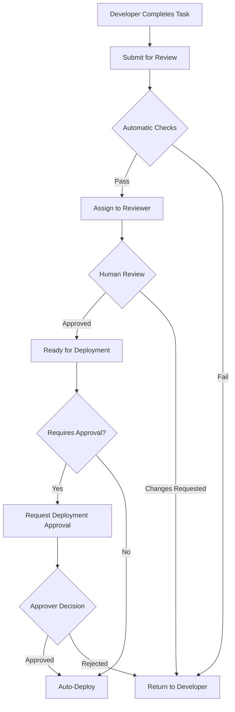

# Phase 4: Intelligence & Optimization - Architecture Document

**Version**: 1.0  
**Date**: October 2025  
**Status**: Planning  

---

## Table of Contents

1. [Executive Summary](#executive-summary)
2. [Phase 4 Goals](#phase-4-goals)
3. [Architecture Overview](#architecture-overview)
4. [Component Deep Dive](#component-deep-dive)
5. [Database Schema](#database-schema)
6. [API Design](#api-design)
7. [Frontend Components](#frontend-components)
8. [Implementation Roadmap](#implementation-roadmap)
9. [Dependencies & Tech Stack](#dependencies--tech-stack)
10. [Security & Compliance](#security--compliance)
11. [Testing Strategy](#testing-strategy)
12. [Deployment Strategy](#deployment-strategy)
13. [Success Metrics](#success-metrics)

---

## Executive Summary

Phase 4 represents the evolution of Catalyst from a functional multi-agent development platform to an intelligent, self-optimizing enterprise system. This phase focuses on:

- **Intelligence**: Agents that learn from experience and improve over time
- **Optimization**: Automated cost reduction and performance enhancement
- **Scale**: Multi-project and multi-team capabilities
- **Enterprise**: Advanced security, compliance, and governance features
- **Insights**: Comprehensive analytics and recommendation systems

**Expected Timeline**: 12-16 weeks  
**Team Size**: 3-4 developers  
**Priority**: High-value enterprise features first

---

## Phase 4 Goals

### Primary Objectives

1. **Reduce Operational Costs by 40%**
   - Smart caching and context management
   - Model selection optimization
   - Token usage reduction

2. **Increase Agent Success Rate to 95%**
   - Learning from failures
   - Pattern recognition from past projects
   - Self-correction mechanisms

3. **Enable Enterprise Adoption**
   - Multi-tenant architecture
   - Advanced security and compliance
   - Team collaboration features

4. **Provide Actionable Insights**
   - Real-time performance dashboards
   - Cost analysis and forecasting
   - Quality metrics tracking

### Key Performance Indicators (KPIs)

- **Cost per Project**: Target <$5 (currently ~$8-10)
- **Average Task Completion Time**: Target <15 minutes
- **Code Quality Score**: Target >85/100
- **User Satisfaction**: Target >4.5/5
- **Token Efficiency**: Target 30% reduction
- **Agent Success Rate**: Target 95%+

---

## Architecture Overview

### High-Level Architecture

```
┌─────────────────────────────────────────────────────────────────┐
│                        Frontend Layer                            │
│  ┌──────────────┐  ┌──────────────┐  ┌──────────────┐          │
│  │  Analytics   │  │   Project    │  │    Team      │          │
│  │  Dashboard   │  │  Management  │  │  Workspace   │          │
│  └──────────────┘  └──────────────┘  └──────────────┘          │
└─────────────────────────────────────────────────────────────────┘
                              ▼
┌─────────────────────────────────────────────────────────────────┐
│                        API Gateway Layer                         │
│  Authentication • Rate Limiting • Request Routing                │
└─────────────────────────────────────────────────────────────────┘
                              ▼
┌─────────────────────────────────────────────────────────────────┐
│                     Core Services Layer                          │
│  ┌──────────────┐  ┌──────────────┐  ┌──────────────┐          │
│  │   Learning   │  │     Cost     │  │  Analytics   │          │
│  │   Service    │  │  Optimizer   │  │   Service    │          │
│  └──────────────┘  └──────────────┘  └──────────────┘          │
│  ┌──────────────┐  ┌──────────────┐  ┌──────────────┐          │
│  │  Refactoring │  │   Security   │  │ Collaboration│          │
│  │   Service    │  │   Scanner    │  │   Service    │          │
│  └──────────────┘  └──────────────┘  └──────────────┘          │
└─────────────────────────────────────────────────────────────────┘
                              ▼
┌─────────────────────────────────────────────────────────────────┐
│                      Agent Orchestrator                          │
│  Phase 1-3 Agents + New Intelligence Layer                       │
└─────────────────────────────────────────────────────────────────┘
                              ▼
┌─────────────────────────────────────────────────────────────────┐
│                        Data Layer                                │
│  MongoDB • Redis Cache • S3 Storage • Vector DB                  │
└─────────────────────────────────────────────────────────────────┘
```

### Technology Stack Updates

**New Additions for Phase 4**:
- **Vector Database**: Pinecone or Weaviate (for semantic search and learning)
- **Time Series DB**: TimescaleDB (for metrics and analytics)
- **Message Queue**: RabbitMQ or Apache Kafka (for async processing)
- **Feature Flags**: LaunchDarkly or PostHog (for gradual rollouts)
- **APM**: DataDog or New Relic (for performance monitoring)

---

## Component Deep Dive

### 4.1 Learning Agent

**Purpose**: Enable the system to learn from past projects and improve over time.

#### Architecture

```python
# Learning Agent Structure
class LearningAgent:
    def __init__(self, vector_db, metrics_db):
        self.vector_db = vector_db  # For semantic similarity search
        self.metrics_db = metrics_db  # For performance tracking
        self.learning_models = {
            'pattern_recognition': PatternRecognitionModel(),
            'success_predictor': SuccessPredictorModel(),
            'code_quality_predictor': CodeQualityModel()
        }
    
    async def learn_from_project(self, project_id):
        """Extract learnings from completed project"""
        pass
    
    async def suggest_improvements(self, context):
        """Suggest improvements based on historical data"""
        pass
    
    async def predict_success_probability(self, task_description):
        """Predict likelihood of successful completion"""
        pass
```

#### Key Features

1. **Pattern Recognition**
   - Identify common patterns in successful projects
   - Detect anti-patterns that lead to failures
   - Store patterns in vector database for semantic search

2. **Historical Analysis**
   - Analyze past 100+ projects
   - Extract common architectures, code patterns, solutions
   - Build knowledge base of proven solutions

3. **Similarity Search**
   - Given a new task, find similar past projects
   - Reuse successful architectures and code
   - Avoid repeating past mistakes

4. **Continuous Improvement**
   - Track agent performance over time
   - Identify areas for improvement
   - A/B test different approaches

#### Data Model

```javascript
// Learning Data Schema
{
  "id": "learning_entry_uuid",
  "project_id": "project_uuid",
  "task_type": "build_app",
  "tech_stack": ["react", "fastapi", "mongodb"],
  "success": true,
  "performance_metrics": {
    "completion_time_seconds": 1200,
    "cost_usd": 4.50,
    "code_quality_score": 87,
    "iterations_needed": 2
  },
  "patterns_identified": [
    "authentication_jwt",
    "crud_api_structure",
    "react_context_state"
  ],
  "code_embeddings": [/* 1536-dim vector */],
  "architecture_embeddings": [/* 1536-dim vector */],
  "lessons_learned": [
    "Use Redis for session management",
    "Implement rate limiting early"
  ],
  "created_at": "2025-10-20T00:00:00Z"
}
```

#### Implementation Steps

1. **Week 1-2**: Setup vector database (Pinecone) and embedding pipeline
2. **Week 3-4**: Build pattern extraction and storage
3. **Week 5-6**: Implement similarity search and suggestion engine
4. **Week 7-8**: Create learning feedback loop and continuous improvement

---

### 4.2 Cost Optimizer

**Purpose**: Automatically reduce LLM costs through intelligent model selection, caching, and optimization.

#### Architecture

```python
class CostOptimizer:
    def __init__(self, cache, metrics_service):
        self.cache = cache  # Redis
        self.metrics = metrics_service
        self.model_costs = {
            'claude-3-7-sonnet': 0.003,  # per 1K tokens
            'claude-3-5-sonnet': 0.015,
            'gpt-4o': 0.005,
            'gpt-4o-mini': 0.00015
        }
    
    async def select_optimal_model(self, task_complexity, budget):
        """Select cheapest model that meets requirements"""
        pass
    
    async def should_use_cache(self, prompt_hash):
        """Check if cached response is available"""
        pass
    
    async def estimate_cost(self, prompt, model):
        """Estimate cost before execution"""
        pass
    
    async def optimize_prompt(self, prompt):
        """Reduce token count without losing meaning"""
        pass
```

#### Key Features

1. **Intelligent Model Selection**
   - Match task complexity to model capability
   - Use cheaper models (GPT-4o-mini) for simple tasks
   - Reserve expensive models (Claude Opus) for complex work

2. **Smart Caching**
   - Cache LLM responses for similar prompts
   - Use semantic similarity for cache hits
   - TTL-based cache invalidation

3. **Token Optimization**
   - Compress prompts without losing context
   - Remove redundant information
   - Use prompt templates efficiently

4. **Budget Management**
   - Set per-project budgets
   - Alert when approaching limits
   - Automatically switch to cheaper models if needed

5. **Context Window Management**
   - Track token usage in conversations
   - Intelligent truncation strategies
   - Summarization of old messages

#### Optimization Strategies

```yaml
# Cost Optimization Rules
optimization_rules:
  - task: code_generation
    preferred_model: gpt-4o-mini
    fallback_model: gpt-4o
    complexity_threshold: 0.7
    
  - task: architecture_design
    preferred_model: claude-3-7-sonnet
    fallback_model: claude-3-5-sonnet
    complexity_threshold: 0.8
    
  - task: code_review
    preferred_model: gpt-4o-mini
    fallback_model: gpt-4o
    complexity_threshold: 0.5
    
  - task: debugging
    preferred_model: gpt-4o
    fallback_model: claude-3-7-sonnet
    complexity_threshold: 0.6
```

#### Caching Strategy

```python
# Cache Key Generation
def generate_cache_key(prompt, model, temperature):
    """Generate semantic cache key"""
    # Use embedding for semantic similarity
    embedding = get_embedding(prompt)
    # Hash embedding + model + temp
    return hash((embedding, model, temperature))

# Cache Lookup
async def check_cache(prompt, model, similarity_threshold=0.95):
    """Check for similar cached responses"""
    embedding = get_embedding(prompt)
    similar_entries = await vector_cache.search(
        embedding, 
        threshold=similarity_threshold
    )
    if similar_entries:
        return similar_entries[0]['response']
    return None
```

#### Implementation Steps

1. **Week 1-2**: Implement Redis caching layer and semantic cache
2. **Week 3-4**: Build model selection logic and complexity analyzer
3. **Week 5-6**: Add token counting and optimization
4. **Week 7-8**: Create budget management and alerting system

---

### 4.3 Code Refactoring Agent

**Purpose**: Analyze and improve existing codebases for quality, performance, and maintainability.

#### Architecture

```python
class RefactoringAgent:
    def __init__(self, llm_client, static_analyzer):
        self.llm = llm_client
        self.analyzer = static_analyzer
        self.refactoring_rules = self._load_rules()
    
    async def analyze_codebase(self, repo_path):
        """Analyze entire codebase for issues"""
        pass
    
    async def suggest_refactorings(self, file_path):
        """Suggest specific refactorings"""
        pass
    
    async def apply_refactoring(self, refactoring_plan):
        """Safely apply refactoring with tests"""
        pass
    
    async def detect_code_smells(self, code):
        """Detect anti-patterns and code smells"""
        pass
```

#### Key Features

1. **Static Code Analysis**
   - Use ESLint, Pylint, SonarQube
   - Detect code smells and anti-patterns
   - Measure cyclomatic complexity

2. **Intelligent Refactoring**
   - Extract methods/functions
   - Remove code duplication
   - Optimize imports and dependencies
   - Improve naming conventions

3. **Performance Optimization**
   - Identify performance bottlenecks
   - Suggest algorithm improvements
   - Database query optimization

4. **Test Coverage Analysis**
   - Identify untested code
   - Generate missing tests
   - Improve test quality

5. **Dependency Updates**
   - Find outdated dependencies
   - Suggest safe upgrades
   - Check for security vulnerabilities

#### Refactoring Types

```javascript
// Refactoring Categories
refactoring_types = {
  "structural": [
    "extract_function",
    "inline_function",
    "extract_class",
    "move_method",
    "rename_variable"
  ],
  "performance": [
    "optimize_loop",
    "reduce_complexity",
    "cache_result",
    "lazy_loading",
    "database_index"
  ],
  "readability": [
    "improve_naming",
    "add_comments",
    "split_long_function",
    "remove_magic_numbers",
    "consistent_formatting"
  ],
  "security": [
    "sanitize_input",
    "fix_sql_injection",
    "add_authentication",
    "encrypt_sensitive_data",
    "fix_xss_vulnerability"
  ]
}
```

#### Analysis Output

```json
{
  "file": "backend/server.py",
  "issues": [
    {
      "type": "complexity",
      "severity": "high",
      "line": 145,
      "message": "Function 'process_request' has complexity of 15 (threshold: 10)",
      "suggestion": "Extract conditional logic into separate functions",
      "estimated_effort": "30 minutes"
    },
    {
      "type": "duplication",
      "severity": "medium",
      "lines": [45, 120],
      "message": "Code duplication detected (85% similar)",
      "suggestion": "Extract common logic into shared function",
      "estimated_effort": "15 minutes"
    }
  ],
  "metrics": {
    "maintainability_index": 72,
    "cyclomatic_complexity": 18,
    "lines_of_code": 450,
    "test_coverage": 65
  }
}
```

#### Implementation Steps

1. **Week 1-2**: Integrate static analysis tools
2. **Week 3-4**: Build refactoring suggestion engine
3. **Week 5-6**: Implement safe refactoring application with rollback
4. **Week 7-8**: Add performance analysis and optimization

---

### 4.4 Security Scanner Agent

**Purpose**: Automated security audits, vulnerability detection, and compliance checking.

#### Architecture

```python
class SecurityScannerAgent:
    def __init__(self, llm_client, vulnerability_db):
        self.llm = llm_client
        self.vuln_db = vulnerability_db  # CVE database
        self.scanners = {
            'sast': StaticAnalysisSecurityTesting(),
            'dast': DynamicAnalysisSecurityTesting(),
            'sca': SoftwareCompositionAnalysis(),
            'secret_scanner': SecretScanner()
        }
    
    async def scan_repository(self, repo_path):
        """Comprehensive security scan"""
        pass
    
    async def check_dependencies(self, package_file):
        """Check for vulnerable dependencies"""
        pass
    
    async def detect_secrets(self, code):
        """Find exposed secrets and credentials"""
        pass
    
    async def generate_security_report(self, scan_results):
        """Generate actionable security report"""
        pass
```

#### Key Features

1. **Vulnerability Scanning**
   - SQL injection detection
   - XSS vulnerability detection
   - CSRF protection validation
   - Authentication/authorization flaws
   - Insecure deserialization

2. **Dependency Security**
   - Check against CVE database
   - Find outdated packages with known vulnerabilities
   - Suggest safe upgrade paths
   - License compliance checking

3. **Secret Detection**
   - API keys, passwords in code
   - AWS credentials, tokens
   - Database connection strings
   - Private keys, certificates

4. **Compliance Checking**
   - OWASP Top 10 compliance
   - GDPR data handling
   - PCI-DSS requirements
   - SOC 2 controls

5. **Security Best Practices**
   - Input validation
   - Output encoding
   - Secure session management
   - Proper error handling
   - Security headers

#### Vulnerability Database Integration

```python
# CVE Database Integration
async def check_cve_database(package_name, version):
    """Check package against CVE database"""
    vulnerabilities = await cve_db.search(
        package=package_name,
        version=version
    )
    
    return [
        {
            "cve_id": vuln.id,
            "severity": vuln.severity,  # CRITICAL, HIGH, MEDIUM, LOW
            "description": vuln.description,
            "affected_versions": vuln.versions,
            "fixed_version": vuln.fixed_in,
            "cvss_score": vuln.cvss_score
        }
        for vuln in vulnerabilities
    ]
```

#### Security Report Format

```json
{
  "scan_id": "scan_uuid",
  "timestamp": "2025-10-20T00:00:00Z",
  "repository": "https://github.com/org/repo",
  "overall_score": 7.2,
  "risk_level": "MEDIUM",
  "summary": {
    "critical": 0,
    "high": 2,
    "medium": 5,
    "low": 12,
    "info": 20
  },
  "vulnerabilities": [
    {
      "id": "VULN-001",
      "type": "SQL_INJECTION",
      "severity": "HIGH",
      "file": "backend/api/users.py",
      "line": 45,
      "description": "Potential SQL injection in user query",
      "recommendation": "Use parameterized queries or ORM",
      "cwe_id": "CWE-89",
      "cvss_score": 8.2,
      "exploitability": "HIGH",
      "fix_effort": "LOW"
    }
  ],
  "dependencies": [
    {
      "package": "requests",
      "version": "2.28.0",
      "vulnerabilities": [
        {
          "cve_id": "CVE-2023-32681",
          "severity": "MEDIUM",
          "fixed_version": "2.31.0"
        }
      ]
    }
  ],
  "secrets_found": [
    {
      "type": "AWS_ACCESS_KEY",
      "file": "config/settings.py",
      "line": 12,
      "masked_value": "AKIA****************"
    }
  ]
}
```

#### Implementation Steps

1. **Week 1-2**: Integrate security scanning tools (Bandit, Semgrep, etc.)
2. **Week 3-4**: Build CVE database integration and dependency checker
3. **Week 5-6**: Implement secret detection and scanning
4. **Week 7-8**: Create security report generation and remediation suggestions

---

### 4.5 Multi-Project Management

**Purpose**: Manage multiple projects simultaneously with cross-project learning and templates.

#### Architecture

```python
class ProjectManager:
    def __init__(self, db, learning_agent):
        self.db = db
        self.learning_agent = learning_agent
    
    async def create_from_template(self, template_id, customizations):
        """Create project from template"""
        pass
    
    async def analyze_portfolio(self, user_id):
        """Analyze all user projects"""
        pass
    
    async def suggest_optimizations(self, project_id):
        """Suggest improvements based on other projects"""
        pass
```

#### Key Features

1. **Project Templates**
   - Predefined templates (SaaS, E-commerce, Dashboard, etc.)
   - Custom templates from successful projects
   - Template marketplace

2. **Portfolio Dashboard**
   - View all projects at once
   - Compare project metrics
   - Cross-project insights

3. **Resource Sharing**
   - Reuse components across projects
   - Shared design systems
   - Common utilities library

4. **Cross-Project Learning**
   - Apply learnings from one project to another
   - Identify common patterns
   - Suggest improvements based on portfolio

#### Template System

```yaml
# Template Definition
template:
  id: saas_starter
  name: "SaaS Application Starter"
  description: "Full-stack SaaS app with auth, billing, and dashboard"
  category: saas
  tags: [authentication, billing, dashboard, multi-tenant]
  
  tech_stack:
    frontend: react
    backend: fastapi
    database: postgresql
    auth: auth0
    payments: stripe
    hosting: vercel
  
  features:
    - user_authentication
    - subscription_billing
    - admin_dashboard
    - user_dashboard
    - email_notifications
    - api_rate_limiting
  
  structure:
    frontend:
      - src/pages/auth/
      - src/pages/dashboard/
      - src/components/billing/
      - src/components/admin/
    backend:
      - api/auth/
      - api/billing/
      - api/admin/
      - services/email/
  
  environment_variables:
    - AUTH0_DOMAIN
    - AUTH0_CLIENT_ID
    - STRIPE_SECRET_KEY
    - DATABASE_URL
    - SMTP_CONFIG
```

#### Implementation Steps

1. **Week 1-2**: Design multi-project database schema
2. **Week 3-4**: Build template system and marketplace
3. **Week 5-6**: Create portfolio dashboard
4. **Week 7-8**: Implement cross-project learning and suggestions

---

### 4.6 Enhanced Collaboration

**Purpose**: Enable team collaboration with workspaces, code reviews, and approval workflows.

#### Architecture

```python
class CollaborationService:
    def __init__(self, db, notification_service):
        self.db = db
        self.notifications = notification_service
    
    async def create_workspace(self, name, owner_id):
        """Create team workspace"""
        pass
    
    async def invite_member(self, workspace_id, email, role):
        """Invite team member"""
        pass
    
    async def submit_for_review(self, project_id, reviewer_id):
        """Submit work for review"""
        pass
    
    async def request_approval(self, deployment_id, approvers):
        """Request deployment approval"""
        pass
```

#### Key Features

1. **Team Workspaces**
   - Shared projects
   - Role-based access (Owner, Admin, Developer, Viewer)
   - Team-wide settings and templates

2. **Code Review System**
   - Human-in-the-loop reviews
   - Review requests and approvals
   - Inline comments and suggestions
   - Review workflows

3. **Approval Workflows**
   - Require approval before deployment
   - Multi-level approvals
   - Audit trail of approvals

4. **Real-time Collaboration**
   - Live project updates
   - Team chat/comments
   - Activity feeds
   - Notifications

5. **Permission Management**
   - Granular permissions
   - Project-level access control
   - Feature flags per role

#### Role-Based Access Control

```javascript
// RBAC Schema
roles = {
  "owner": {
    "permissions": ["*"],  // All permissions
    "description": "Full access to workspace"
  },
  "admin": {
    "permissions": [
      "projects.create",
      "projects.read",
      "projects.update",
      "projects.delete",
      "members.invite",
      "members.remove",
      "deployments.approve",
      "settings.update"
    ]
  },
  "developer": {
    "permissions": [
      "projects.create",
      "projects.read",
      "projects.update",
      "deployments.request",
      "code.review"
    ]
  },
  "reviewer": {
    "permissions": [
      "projects.read",
      "code.review",
      "code.approve"
    ]
  },
  "viewer": {
    "permissions": [
      "projects.read",
      "analytics.view"
    ]
  }
}
```

#### Review Workflow



#### Implementation Steps

1. **Week 1-2**: Design workspace and RBAC system
2. **Week 3-4**: Build invitation and member management
3. **Week 5-6**: Implement review workflows
4. **Week 7-8**: Add approval workflows and notifications

---

### 4.7 Analytics & Insights

**Purpose**: Comprehensive dashboards for performance metrics, costs, and quality tracking.

#### Architecture

```python
class AnalyticsService:
    def __init__(self, timeseries_db, cache):
        self.tsdb = timeseries_db  # TimescaleDB
        self.cache = cache
    
    async def track_metric(self, metric_name, value, tags):
        """Track a metric"""
        pass
    
    async def get_dashboard_data(self, dashboard_id, timerange):
        """Get dashboard data"""
        pass
    
    async def generate_insights(self, user_id):
        """Generate AI-powered insights"""
        pass
```

#### Key Dashboards

1. **Performance Dashboard**
   - Task completion times
   - Agent efficiency metrics
   - System uptime and reliability
   - API response times

2. **Cost Dashboard**
   - Token usage over time
   - Cost per project/task
   - Budget tracking
   - Cost forecasting

3. **Quality Dashboard**
   - Code quality scores
   - Test coverage trends
   - Bug density
   - Technical debt

4. **Usage Dashboard**
   - Active users
   - Project creation rate
   - Feature adoption
   - User engagement

#### Metrics Collection

```python
# Metrics Schema
metrics_schema = {
    "timestamp": datetime,
    "metric_name": str,  # e.g., "task.completion_time"
    "value": float,
    "unit": str,  # e.g., "seconds", "dollars", "percentage"
    "tags": {
        "user_id": str,
        "project_id": str,
        "agent": str,
        "task_type": str,
        "model": str
    }
}

# Example Metrics
metrics = [
    "task.completion_time",
    "task.cost",
    "task.success_rate",
    "agent.response_time",
    "agent.error_rate",
    "token.usage",
    "token.cost",
    "code.quality_score",
    "code.test_coverage",
    "deployment.frequency",
    "deployment.success_rate"
]
```

#### Real-time Insights Engine

```python
# AI-Powered Insights
class InsightsEngine:
    async def generate_insights(self, user_id):
        """Generate personalized insights"""
        
        insights = []
        
        # Cost optimization insights
        if await self.detect_high_costs(user_id):
            insights.append({
                "type": "cost_optimization",
                "severity": "high",
                "title": "High Token Usage Detected",
                "description": "Your token usage is 40% higher than similar projects",
                "recommendation": "Consider using GPT-4o-mini for simpler tasks",
                "potential_savings": "$15/month"
            })
        
        # Performance insights
        if await self.detect_slow_tasks(user_id):
            insights.append({
                "type": "performance",
                "severity": "medium",
                "title": "Task Completion Time Increased",
                "description": "Average task time increased by 25% this week",
                "recommendation": "Review recent prompt changes or increase timeout limits"
            })
        
        return insights
```

#### Implementation Steps

1. **Week 1-2**: Setup TimescaleDB and metrics collection pipeline
2. **Week 3-4**: Build performance and cost dashboards
3. **Week 5-6**: Implement quality and usage dashboards
4. **Week 7-8**: Create insights engine and recommendations

---

### 4.8 Extended Integrations

**Purpose**: Integrate with popular third-party services for auth, payments, analytics, and more.

#### Integration Categories

1. **Database Platforms**
   - Supabase (PostgreSQL + Auth + Storage)
   - Firebase (Realtime DB + Auth)
   - PlanetScale (MySQL)
   - Neon (Serverless Postgres)

2. **Authentication**
   - Auth0 (Enterprise SSO)
   - Clerk (User management)
   - Firebase Auth
   - AWS Cognito

3. **Payments**
   - Stripe (Enhanced integration)
   - PayPal
   - Square
   - Paddle

4. **Analytics**
   - Mixpanel (Product analytics)
   - Amplitude (Behavioral analytics)
   - PostHog (Open-source analytics)
   - Google Analytics 4

5. **Communication**
   - SendGrid (Email)
   - Twilio (SMS)
   - Slack (Notifications)
   - Discord (Community)

6. **CI/CD**
   - GitHub Actions
   - GitLab CI
   - CircleCI
   - Jenkins

#### Integration Framework

```python
# Base Integration Class
class BaseIntegration:
    def __init__(self, config):
        self.config = config
        self.client = None
    
    async def authenticate(self):
        """Authenticate with service"""
        raise NotImplementedError
    
    async def validate_credentials(self):
        """Validate credentials"""
        raise NotImplementedError
    
    async def setup_webhook(self, callback_url):
        """Setup webhook for events"""
        raise NotImplementedError
    
    async def test_connection(self):
        """Test connection to service"""
        raise NotImplementedError

# Example: Supabase Integration
class SupabaseIntegration(BaseIntegration):
    async def authenticate(self):
        from supabase import create_client
        self.client = create_client(
            self.config['url'],
            self.config['key']
        )
    
    async def create_table(self, table_schema):
        """Create database table"""
        pass
    
    async def setup_auth(self, providers):
        """Configure authentication providers"""
        pass
    
    async def setup_storage(self, bucket_name):
        """Setup file storage bucket"""
        pass
```

#### Implementation Steps

1. **Week 1-2**: Design integration framework and plugin system
2. **Week 3-5**: Implement database integrations (Supabase, Firebase)
3. **Week 6-8**: Add auth integrations (Auth0, Clerk)
4. **Week 9-10**: Payment integrations (Stripe enhancements)
5. **Week 11-12**: Analytics and communication integrations

---

### 4.9 Enterprise Features

**Purpose**: Advanced security, compliance, and governance for enterprise customers.

#### Key Features

1. **Audit Logs**
   - Complete activity tracking
   - Tamper-proof logs
   - Compliance reporting
   - Log retention policies

2. **Role-Based Access Control (RBAC)**
   - Custom roles and permissions
   - Fine-grained access control
   - Permission inheritance
   - Temporary access grants

3. **Single Sign-On (SSO)**
   - SAML 2.0 support
   - OAuth 2.0 / OpenID Connect
   - Active Directory integration
   - Custom identity providers

4. **Custom Policies**
   - Deployment policies
   - Code standards enforcement
   - Security policies
   - Compliance checks

5. **SLA Monitoring**
   - Uptime tracking
   - Performance SLAs
   - Automated incident response
   - SLA reporting

6. **Data Governance**
   - Data classification
   - Data retention policies
   - Data encryption at rest/transit
   - GDPR compliance tools

#### Audit Log System

```python
# Audit Log Schema
audit_log_schema = {
    "id": str,
    "timestamp": datetime,
    "user_id": str,
    "user_email": str,
    "action": str,  # e.g., "project.create", "deployment.approve"
    "resource_type": str,  # e.g., "project", "user", "workspace"
    "resource_id": str,
    "ip_address": str,
    "user_agent": str,
    "changes": {
        "before": dict,
        "after": dict
    },
    "status": str,  # "success", "failure"
    "error_message": str,  # if failure
    "metadata": dict
}

# Audit Log Service
class AuditLogService:
    async def log(self, action, user, resource, changes=None):
        """Create audit log entry"""
        log_entry = {
            "id": generate_uuid(),
            "timestamp": datetime.now(timezone.utc),
            "user_id": user.id,
            "user_email": user.email,
            "action": action,
            "resource_type": resource.type,
            "resource_id": resource.id,
            "changes": changes,
            "status": "success"
        }
        
        # Store in immutable storage (S3, blockchain, etc.)
        await self.store_audit_log(log_entry)
        
        # Also store in searchable database
        await self.db.audit_logs.insert_one(log_entry)
    
    async def search_logs(self, filters, timerange):
        """Search audit logs"""
        pass
    
    async def export_logs(self, format="csv"):
        """Export logs for compliance"""
        pass
```

#### SSO Implementation

```python
# SAML SSO Integration
class SAMLSSOProvider:
    def __init__(self, config):
        self.config = config
        self.sp_config = self._load_sp_config()
    
    async def initiate_login(self, redirect_url):
        """Initiate SAML login flow"""
        pass
    
    async def process_response(self, saml_response):
        """Process SAML assertion"""
        pass
    
    async def logout(self, user_id):
        """Initiate SAML logout"""
        pass
```

#### Implementation Steps

1. **Week 1-3**: Implement audit logging system
2. **Week 4-6**: Build RBAC system
3. **Week 7-9**: Add SSO support (SAML, OAuth)
4. **Week 10-12**: Implement policy engine and SLA monitoring

---

## Database Schema

### New Collections/Tables

#### 1. Learning Entries

```javascript
{
  "_id": ObjectId,
  "id": "uuid",
  "project_id": "uuid",
  "task_type": "string",
  "tech_stack": ["string"],
  "success": boolean,
  "performance_metrics": {
    "completion_time_seconds": number,
    "cost_usd": number,
    "code_quality_score": number,
    "iterations_needed": number
  },
  "patterns_identified": ["string"],
  "code_embeddings": [number],  // 1536-dim vector
  "architecture_embeddings": [number],
  "lessons_learned": ["string"],
  "created_at": ISODate
}
```

#### 2. Project Templates

```javascript
{
  "_id": ObjectId,
  "id": "uuid",
  "name": "string",
  "description": "string",
  "category": "string",
  "tags": ["string"],
  "tech_stack": {
    "frontend": "string",
    "backend": "string",
    "database": "string"
  },
  "features": ["string"],
  "structure": object,
  "environment_variables": ["string"],
  "popularity": number,
  "usage_count": number,
  "rating": number,
  "created_by": "uuid",
  "is_public": boolean,
  "created_at": ISODate,
  "updated_at": ISODate
}
```

#### 3. Workspaces

```javascript
{
  "_id": ObjectId,
  "id": "uuid",
  "name": "string",
  "owner_id": "uuid",
  "members": [
    {
      "user_id": "uuid",
      "role": "string",  // owner, admin, developer, reviewer, viewer
      "invited_at": ISODate,
      "joined_at": ISODate
    }
  ],
  "projects": ["uuid"],
  "settings": {
    "allow_external_collaborators": boolean,
    "require_code_review": boolean,
    "require_deployment_approval": boolean,
    "default_llm_provider": "string"
  },
  "billing": {
    "plan": "string",  // free, pro, enterprise
    "usage_limit": number,
    "current_usage": number
  },
  "created_at": ISODate,
  "updated_at": ISODate
}
```

#### 4. Code Reviews

```javascript
{
  "_id": ObjectId,
  "id": "uuid",
  "project_id": "uuid",
  "task_id": "uuid",
  "reviewer_id": "uuid",
  "submitter_id": "uuid",
  "status": "string",  // pending, approved, changes_requested, rejected
  "files": [
    {
      "path": "string",
      "diff": "string",
      "comments": [
        {
          "line": number,
          "comment": "string",
          "author_id": "uuid",
          "created_at": ISODate
        }
      ]
    }
  ],
  "overall_comment": "string",
  "submitted_at": ISODate,
  "reviewed_at": ISODate
}
```

#### 5. Metrics (TimescaleDB)

```sql
CREATE TABLE metrics (
    time TIMESTAMPTZ NOT NULL,
    metric_name VARCHAR(100) NOT NULL,
    value DOUBLE PRECISION,
    unit VARCHAR(20),
    user_id VARCHAR(50),
    project_id VARCHAR(50),
    agent VARCHAR(50),
    task_type VARCHAR(50),
    model VARCHAR(50),
    PRIMARY KEY (time, metric_name, user_id, project_id)
);

-- Create hypertable for time-series optimization
SELECT create_hypertable('metrics', 'time');

-- Create indexes
CREATE INDEX idx_metrics_user ON metrics(user_id, time DESC);
CREATE INDEX idx_metrics_project ON metrics(project_id, time DESC);
```

#### 6. Audit Logs

```javascript
{
  "_id": ObjectId,
  "id": "uuid",
  "timestamp": ISODate,
  "user_id": "uuid",
  "user_email": "string",
  "action": "string",
  "resource_type": "string",
  "resource_id": "uuid",
  "ip_address": "string",
  "user_agent": "string",
  "changes": {
    "before": object,
    "after": object
  },
  "status": "string",
  "error_message": "string",
  "metadata": object
}
```

---

## API Design

### New API Endpoints

#### Learning Agent

```
GET    /api/learning/patterns                    # Get learned patterns
POST   /api/learning/extract                     # Extract learning from project
GET    /api/learning/similar/:task_description   # Find similar projects
POST   /api/learning/suggest                     # Get improvement suggestions
GET    /api/learning/success-probability         # Predict success probability
```

#### Cost Optimizer

```
GET    /api/optimizer/cost-estimate             # Estimate task cost
POST   /api/optimizer/select-model              # Get optimal model for task
GET    /api/optimizer/budget/:project_id        # Get budget status
POST   /api/optimizer/budget/:project_id        # Set budget
GET    /api/optimizer/cache-stats               # Get cache statistics
```

#### Refactoring Agent

```
POST   /api/refactor/analyze                    # Analyze codebase
POST   /api/refactor/suggest                    # Get refactoring suggestions
POST   /api/refactor/apply                      # Apply refactoring
GET    /api/refactor/report/:project_id         # Get refactoring report
```

#### Security Scanner

```
POST   /api/security/scan                       # Start security scan
GET    /api/security/report/:scan_id            # Get scan report
GET    /api/security/vulnerabilities/:project_id # Get vulnerabilities
POST   /api/security/fix                        # Apply security fixes
```

#### Project Management

```
GET    /api/projects/templates                  # List templates
POST   /api/projects/from-template              # Create from template
GET    /api/projects/portfolio/:user_id         # Get portfolio
POST   /api/projects/compare                    # Compare projects
```

#### Collaboration

```
POST   /api/workspaces                          # Create workspace
POST   /api/workspaces/:id/invite               # Invite member
GET    /api/workspaces/:id/members              # List members
POST   /api/reviews                             # Submit for review
PUT    /api/reviews/:id                         # Update review
POST   /api/approvals                           # Request approval
PUT    /api/approvals/:id                       # Approve/reject
```

#### Analytics

```
GET    /api/analytics/dashboard/:dashboard_id   # Get dashboard data
GET    /api/analytics/metrics                   # Query metrics
POST   /api/analytics/metrics                   # Track custom metric
GET    /api/analytics/insights/:user_id         # Get AI insights
GET    /api/analytics/export                    # Export data
```

#### Integrations

```
GET    /api/integrations                        # List available integrations
POST   /api/integrations/:type/connect          # Connect integration
GET    /api/integrations/:id/status             # Check integration status
POST   /api/integrations/:id/test               # Test integration
DELETE /api/integrations/:id                    # Disconnect integration
```

#### Audit & Compliance

```
GET    /api/audit/logs                          # Search audit logs
GET    /api/audit/export                        # Export logs
GET    /api/compliance/report/:type             # Get compliance report
GET    /api/sla/status                          # Get SLA status
```

---

## Frontend Components

### New Pages

1. **Analytics Dashboard** (`/analytics`)
   - Performance metrics
   - Cost tracking
   - Quality trends
   - Usage statistics

2. **Portfolio View** (`/portfolio`)
   - All projects overview
   - Project comparison
   - Cross-project insights

3. **Workspace Management** (`/workspace`)
   - Team members
   - Roles and permissions
   - Workspace settings

4. **Code Review** (`/reviews`)
   - Pending reviews
   - Review history
   - Inline code comments

5. **Security Center** (`/security`)
   - Vulnerability dashboard
   - Scan history
   - Remediation tracking

6. **Template Marketplace** (`/templates`)
   - Browse templates
   - Template details
   - Custom templates

7. **Settings & Integrations** (`/settings/integrations`)
   - Connected services
   - Integration configuration
   - API key management

### New Components

```jsx
// Analytics Components
<PerformanceChart data={metrics} timeRange="30d" />
<CostTrendChart costs={costData} />
<QualityScoreCard score={85} trend="up" />
<TokenUsageGauge current={150000} limit={200000} />

// Collaboration Components
<WorkspaceMembers members={members} onInvite={handleInvite} />
<CodeReviewPanel review={review} />
<ApprovalWorkflow approvals={approvals} />

// Security Components
<VulnerabilityList vulnerabilities={vulns} />
<SecurityScoreCard score={7.2} />
<DependencyTable dependencies={deps} />

// Project Components
<TemplateGrid templates={templates} />
<PortfolioDashboard projects={projects} />
<ProjectComparisonTable projects={[p1, p2]} />
```

---

## Implementation Roadmap

### Phase 4.1: Foundation (Weeks 1-4)

**Goal**: Setup infrastructure for Phase 4 features

- [ ] Setup Vector Database (Pinecone/Weaviate)
- [ ] Setup TimescaleDB for metrics
- [ ] Setup Redis for caching
- [ ] Create base learning data models
- [ ] Implement metrics collection pipeline
- [ ] Setup basic analytics dashboard

**Deliverables**:
- Working vector database with embedding pipeline
- Metrics collection system
- Basic analytics dashboard

### Phase 4.2: Intelligence (Weeks 5-8)

**Goal**: Implement learning and optimization features

- [ ] Build Learning Agent
  - Pattern recognition
  - Similarity search
  - Success prediction
- [ ] Build Cost Optimizer
  - Model selection logic
  - Smart caching
  - Token optimization
  - Budget management
- [ ] Create analytics dashboards
  - Performance dashboard
  - Cost dashboard

**Deliverables**:
- Functional Learning Agent
- Cost Optimizer reducing costs by 20%+
- Analytics dashboards showing insights

### Phase 4.3: Quality & Security (Weeks 9-12)

**Goal**: Implement refactoring and security features

- [ ] Build Refactoring Agent
  - Static code analysis
  - Refactoring suggestions
  - Safe application with tests
- [ ] Build Security Scanner
  - Vulnerability detection
  - Dependency checking
  - Secret scanning
  - Compliance reports
- [ ] Quality dashboard

**Deliverables**:
- Refactoring Agent with actionable suggestions
- Security Scanner with comprehensive reports
- Quality metrics tracking

### Phase 4.4: Collaboration (Weeks 13-16)

**Goal**: Enable team collaboration

- [ ] Build Workspace system
- [ ] Implement RBAC
- [ ] Create Code Review system
- [ ] Build Approval Workflows
- [ ] Real-time notifications

**Deliverables**:
- Working team workspaces
- Code review and approval system
- Real-time collaboration features

### Phase 4.5: Enterprise (Weeks 17-20)

**Goal**: Enterprise-grade features

- [ ] Implement Audit Logging
- [ ] Build SSO integration
- [ ] Create Policy Engine
- [ ] SLA Monitoring
- [ ] Compliance reporting

**Deliverables**:
- Enterprise-ready security features
- SSO with major providers
- Compliance tooling

### Phase 4.6: Integrations (Weeks 21-24)

**Goal**: Expand third-party integrations

- [ ] Database platforms (Supabase, Firebase)
- [ ] Auth providers (Auth0, Clerk)
- [ ] Payment processors
- [ ] Analytics tools
- [ ] CI/CD platforms

**Deliverables**:
- 10+ new integrations
- Integration marketplace
- Plugin system

---

## Dependencies & Tech Stack

### New Dependencies

**Backend**:
```python
# Vector Database
pinecone-client==2.2.4
weaviate-client==3.25.0

# Time Series
psycopg2-binary==2.9.9
timescaledb==2.13.0

# Security
bandit==1.7.5
semgrep==1.45.0
safety==2.3.5

# Code Analysis
radon==6.0.1  # Complexity analysis
pylint==3.0.2
black==23.11.0

# Message Queue
celery==5.3.4
redis==5.0.1

# Feature Flags
launchdarkly-server-sdk==8.2.1

# Monitoring
datadog==0.47.0
sentry-sdk==1.38.0
```

**Frontend**:
```json
{
  "dependencies": {
    "recharts": "^2.10.0",
    "react-diff-viewer": "^3.1.1",
    "@datadog/browser-logs": "^5.0.0",
    "launchdarkly-react-client-sdk": "^3.0.0",
    "react-markdown": "^9.0.0"
  }
}
```

### Infrastructure Requirements

**Database**:
- MongoDB Atlas M10 or higher (for workload)
- TimescaleDB instance (for metrics)
- Redis cluster (for caching)
- Pinecone index (for vectors)

**Compute**:
- Backend: 4-8 vCPU, 16-32GB RAM
- Worker processes for background tasks
- Message queue (RabbitMQ or Redis)

**Storage**:
- S3 bucket for audit logs
- Increased MongoDB storage for analytics data

---

## Security & Compliance

### Security Measures

1. **Data Encryption**
   - At rest: AES-256
   - In transit: TLS 1.3
   - Database encryption enabled

2. **Authentication & Authorization**
   - JWT with refresh tokens
   - MFA support
   - OAuth 2.0 / SAML SSO

3. **API Security**
   - Rate limiting
   - Input validation
   - CORS configuration
   - API key rotation

4. **Secrets Management**
   - AWS Secrets Manager / Vault
   - No secrets in code
   - Encrypted environment variables

### Compliance

1. **GDPR**
   - Data privacy controls
   - Right to deletion
   - Data export functionality
   - Consent management

2. **SOC 2**
   - Audit logging
   - Access controls
   - Incident response
   - Change management

3. **HIPAA** (if handling health data)
   - PHI encryption
   - Access logs
   - Breach notification

---

## Testing Strategy

### Testing Levels

1. **Unit Tests**
   - Coverage target: 80%+
   - Test all service methods
   - Mock external dependencies

2. **Integration Tests**
   - API endpoint tests
   - Database integration tests
   - External service integration tests

3. **E2E Tests**
   - Critical user flows
   - Playwright/Cypress tests
   - Cross-browser testing

4. **Performance Tests**
   - Load testing (k6, Artillery)
   - Stress testing
   - Latency benchmarks

5. **Security Tests**
   - OWASP ZAP scanning
   - Dependency vulnerability scanning
   - Penetration testing

### Test Automation

```yaml
# CI/CD Pipeline
stages:
  - test
  - security_scan
  - build
  - deploy

unit_tests:
  stage: test
  script:
    - pytest tests/unit --cov=backend --cov-report=xml
    - yarn test --coverage

integration_tests:
  stage: test
  script:
    - pytest tests/integration

security_scan:
  stage: security_scan
  script:
    - bandit -r backend/
    - safety check
    - npm audit

e2e_tests:
  stage: test
  script:
    - playwright test
```

---

## Deployment Strategy

### Deployment Phases

**Phase 1: Alpha (Internal)**
- Deploy to staging environment
- Internal team testing
- Collect feedback
- Fix critical bugs

**Phase 2: Beta (Limited Users)**
- Deploy to subset of users
- Feature flags for gradual rollout
- Monitor metrics closely
- Iterate based on feedback

**Phase 3: General Availability**
- Full production deployment
- All users have access
- Continue monitoring
- Regular updates

### Feature Flags

```python
# Feature Flag Usage
from launchdarkly import LDClient

ld_client = LDClient(os.getenv('LAUNCHDARKLY_SDK_KEY'))

def is_feature_enabled(feature_name, user):
    """Check if feature is enabled for user"""
    return ld_client.variation(feature_name, user, False)

# Example
if is_feature_enabled('learning_agent', current_user):
    # Use learning agent
    learning_agent.suggest_improvements(project)
else:
    # Use old approach
    pass
```

### Rollback Strategy

1. **Database Migrations**
   - Backward compatible migrations
   - Migration rollback scripts
   - Test migrations in staging

2. **Code Deployment**
   - Blue-green deployment
   - Quick rollback capability
   - Health checks before switching

3. **Monitoring**
   - Error rate monitoring
   - Performance metrics
   - Auto-rollback triggers

---

## Success Metrics

### Phase 4 KPIs

| Metric | Baseline | Target | Measurement |
|--------|----------|--------|-------------|
| **Cost per Project** | $8-10 | <$5 | Average LLM cost |
| **Token Efficiency** | 100% | 70% | Tokens used vs baseline |
| **Task Success Rate** | 85% | 95% | Successful completions |
| **Avg Completion Time** | 20 min | <15 min | Time to complete task |
| **Code Quality Score** | 75 | >85 | Static analysis score |
| **User Satisfaction** | 4.0/5 | >4.5/5 | User surveys |
| **Security Score** | N/A | >8/10 | Security scan results |
| **System Uptime** | 99% | 99.9% | Availability |

### Business Metrics

- **Enterprise Adoption**: 10+ enterprise customers in 6 months
- **MRR Growth**: 50% increase
- **User Retention**: >90% monthly retention
- **Feature Adoption**: >60% of users using Phase 4 features
- **Cost Savings**: $100K+ in LLM costs saved (cumulative)

---

## Risk Assessment

### Technical Risks

| Risk | Likelihood | Impact | Mitigation |
|------|-----------|--------|------------|
| Vector DB performance issues | Medium | High | Load testing, caching, index optimization |
| LLM API rate limits | High | Medium | Implement queue, retry logic, multiple providers |
| Data migration complexity | Medium | High | Phased migration, thorough testing |
| Integration failures | Medium | Medium | Circuit breakers, fallback mechanisms |
| Security vulnerabilities | Low | High | Regular audits, pen testing, security team |

### Business Risks

| Risk | Likelihood | Impact | Mitigation |
|------|-----------|--------|------------|
| Feature adoption low | Medium | High | User education, great UX, clear value prop |
| Development delays | Medium | Medium | Buffer time, prioritize MVP features |
| Budget overrun | Low | Medium | Strict cost monitoring, cloud cost optimization |
| Competition | High | Medium | Fast execution, unique features, quality |

---

## Appendix

### Glossary

- **SAST**: Static Application Security Testing
- **DAST**: Dynamic Application Security Testing
- **SCA**: Software Composition Analysis
- **RBAC**: Role-Based Access Control
- **SSO**: Single Sign-On
- **SLA**: Service Level Agreement
- **KPI**: Key Performance Indicator
- **MRR**: Monthly Recurring Revenue
- **CVE**: Common Vulnerabilities and Exposures

### References

- [OWASP Top 10](https://owasp.org/www-project-top-ten/)
- [LangChain Documentation](https://python.langchain.com/)
- [Pinecone Vector Database](https://www.pinecone.io/)
- [TimescaleDB Documentation](https://docs.timescale.com/)
- [GDPR Compliance Guide](https://gdpr.eu/)
- [SOC 2 Compliance](https://www.aicpa.org/soc)

---

**Document Owner**: Engineering Team  
**Last Updated**: October 2025  
**Next Review**: November 2025

---

*This is a living document and will be updated as Phase 4 implementation progresses.*
